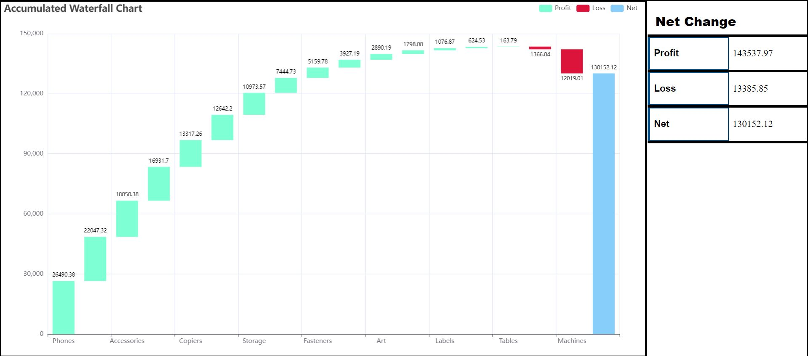
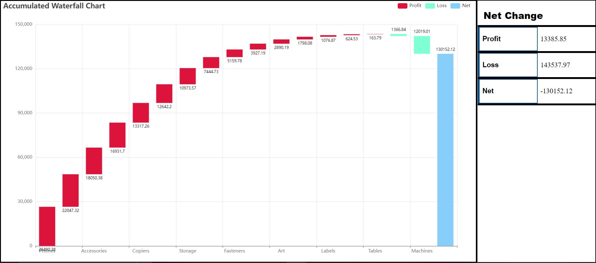

# Echarts-WaterFall

## Description
### Build a WaterFall Curve:-
- data is coming from the API
- Processing the data and convert it into JSON Format
- Plot the curve using ECharts library
- If total sum of all differences is negative the graph starts from negative 
- Else it will start from +ve

## See Live Demo

### visit --> https://echartswaterfallishanjain.netlify.app/

## Screenshots

### Net value is Positive

### Net value is Negative

## Technologies Stack:

- HTML
- CSS
- Javascript

### How to install
- Clone the project onto your local machine.
- Open index.html file in browser.
- That's it now project is ready for use.